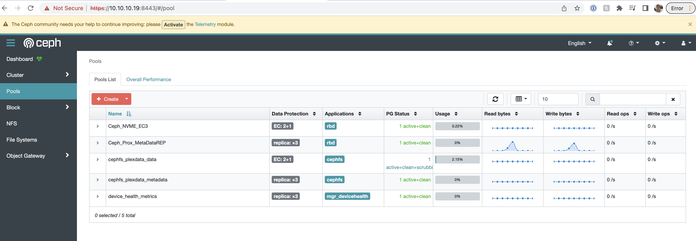
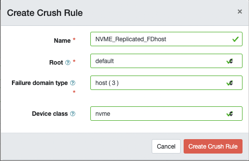
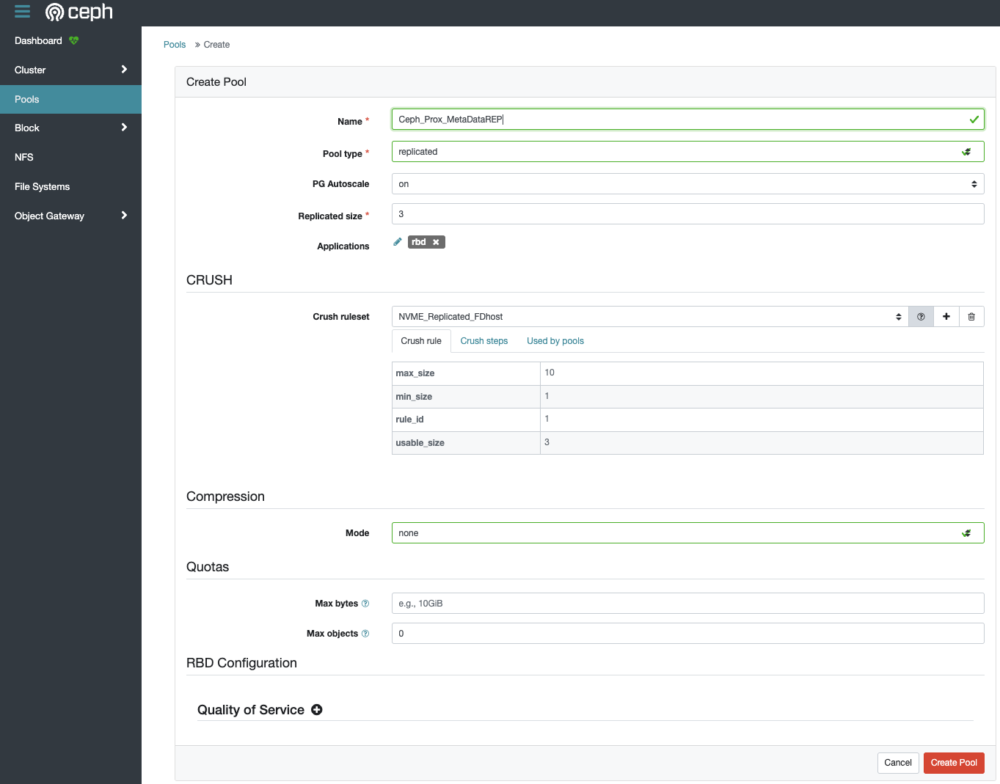
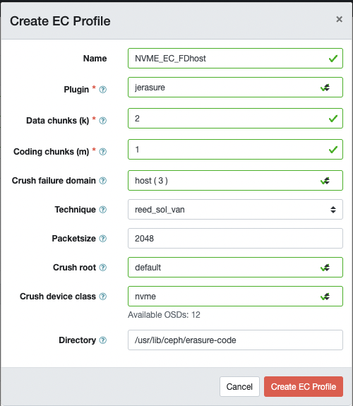
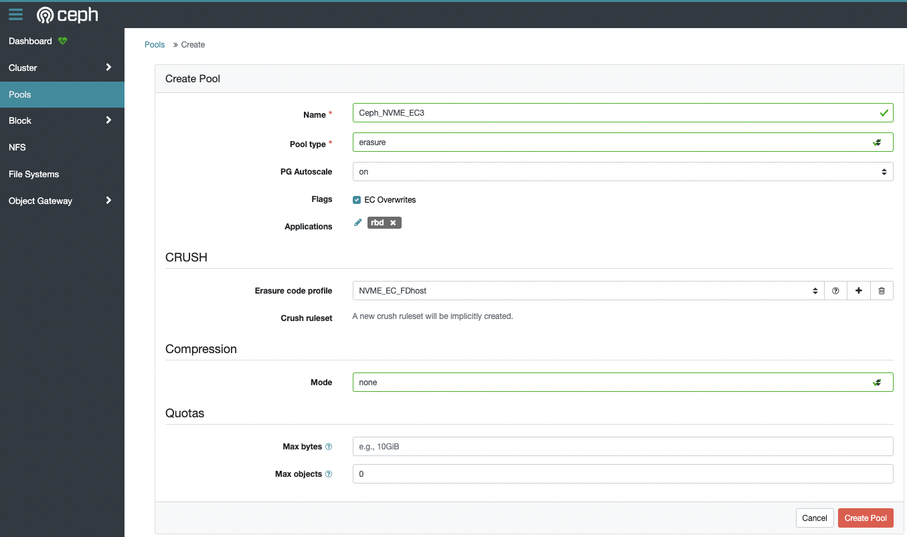
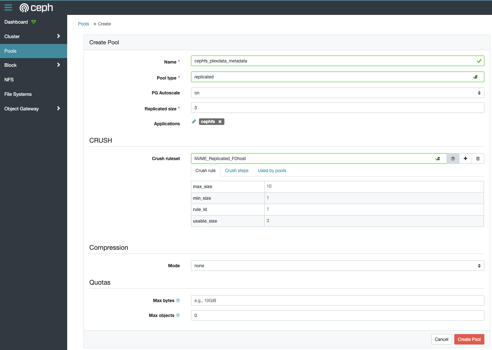
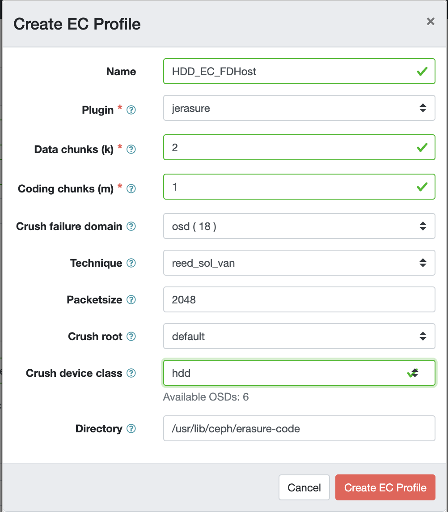
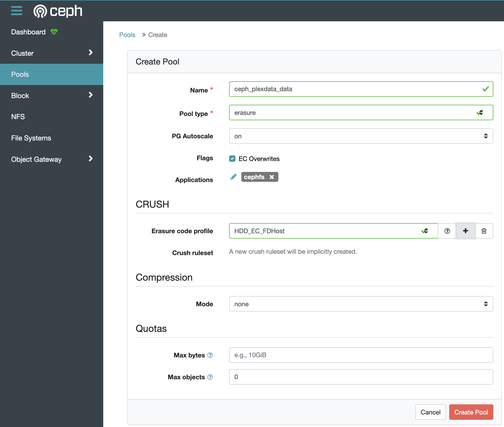
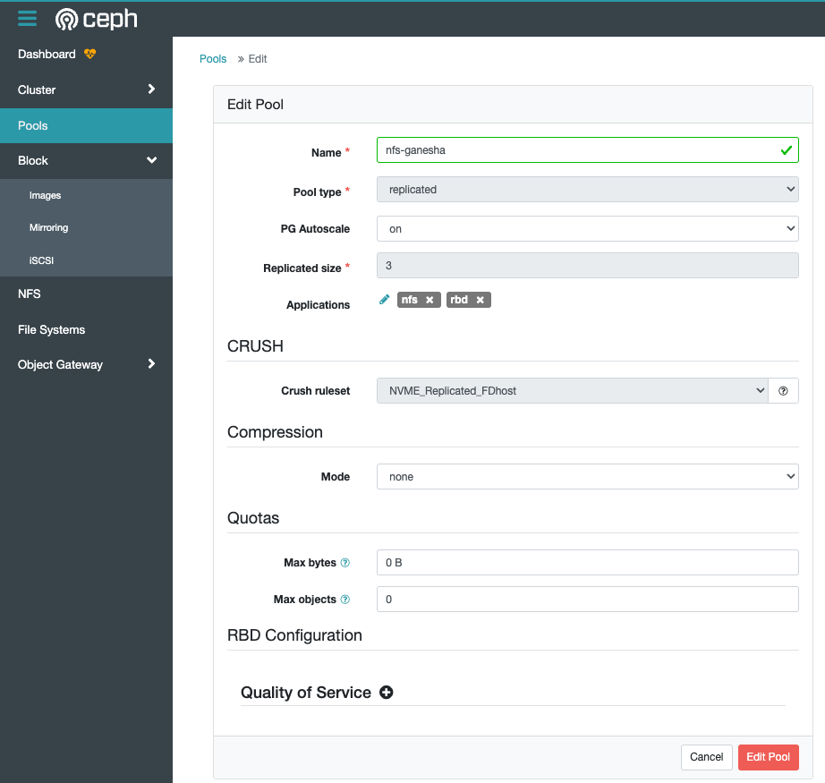
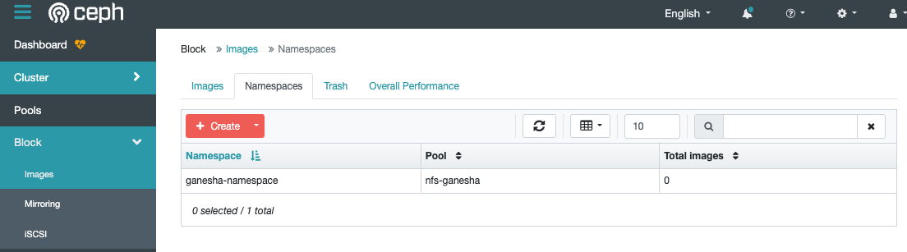

# Proxmox

A simple role to baseline configuration of Proxmox in infrastructure

## Requirements

1. Hosts defined in the hosts file under group 'proxmox'. Hostnames must end with a number [0-9] EG: prox1, prox2, etc
2. ```dns: [0.0.0.0]``` variable list configured
3. NFS host setup with ISO share (for downloading ISO's) Configured in: vars/main.yml ```nfs:```

## Example Playbook

See ../proxmox.yml

```yaml
---
- hosts: proxmox
  roles:
    - proxmox
```

## Functionality

The playbook performs all of these by default (or independantly with tags):
1. Setup of a proxmox host ```ansible-playbook proxmox.yml --tags setup```
  - Network in /etc/network/interfaces can be setup with ```--tags network```
  - NFS mount point can be set with ```--tags nfs```
2. Downloading of cloud images/ISO's and container templates ```ansible-playbook proxmox.yml --tags update_images```
  * (Optional Tagging) `--tags update_iso_images` will ONLY re-download VM Cloud image/ISO's to storage `local-zfs` or `local` if local-zfs not configured.
  * (Optional Tagging) `--tags update_container_images` will download CT Templates to storage `local` (Note local-zfs doesn't hold CT Templates)
3. Clusters together all proxmox nodes in the playbook ```ansible-playbook proxmox.yml --tags cluster```
4. Creation of VM template for use on each nodes local-* storage ```ansible-playbook proxmox.yml --tags templates --ask-vault-password```
5. Setup Metric Server to ship metrics to InfluxDB ```ansible-playbook proxmox.yml --tags metrics --ask-vault-password```
6. Setup and initalise Ceph ```ansible-playbook proxmox.yml --tags ceph --ask-vault-password```
7. Setup NFS Ganesha nodes for HA ```ansible-playbook proxmox.yml --tags nfs --ask-vault-password```

### 1. Setup
- apt sources to point to non-enterprise (no subscription), and ensures apt packages are updated after changing sources
- sets "iommu=on" for either Intel or AMD based CPU's in Grub config
- sets the hostname of the proxmox host to be the same as configured in ansible hosts file
- sets DNS servers in /etc/resolv.conf as defined in global group_vars -> all.yml -> dns
- manages the network setup in /etc/network/interfaces, depending on config for ```pve_second_nic_regex``` and ```pve_ceph_enabled```
- attaches NFS storage defined in vars -> main.yml -> nfs (use: ```--tags nfs|mounts```)

### 2. Download of cloud images
- ensures the latest ISO versions are available on the NFS share, which are defined in vars -> main.yml -> images

### 3. Clustering
- adds all hosts into a cluster by default. To disable clustering, configure: ```pve_cluster_enabled: no```
** See the notes on clustering below **

### 4. VM Cloud image template
- creates a Ubuntu cloud image template with VM ID 800# where # is the host node number. 
  Template uses the following variables to be defined outside of this role:
     ```infadmin_password:``` to be set (in vault)
     ```provisioning_user:``` which will be the default user account in the cloudimage template configuration
     ```search_domain:```     default DNS search domain for cloud image VM's deployed

### 5. Metrics Server
- adds metrics servers to proxmox (works with clusters). Proxmox uses Graphite or InfluxDB integrations. 
  These variables can be referenced for this role. Example using a v2 InfluxDB:
```
vars:
  pve_metrics_servers:
    - name: InfluxDB
      port: 8089
      server: 172.23.0.1
      type: influxdb
      bucket: proxmox
      influxdbproto: http
      organization: homelab
      token: "{{ your_token_var }}"
      # use when need to update an existing metric server token:
      #updatetoken: yes
```
All variables can be seen in [pve_metrics_server.yml][metrics-yaml], or lookup the [Proxmox API][proxmox-api-metrics]

Further reading can be found:
- [Proxmox External Metric Server][metrics-doc2]
- [Proxmox Admin Guide: Metric Server][metrics-doc1]
- [Youtube guide][metrics-guide]

### 6. Ceph
This will setup Ceph by performing:
- Package install and initalisation of ceph
- Mon and Mgr deployments on all nodes
- [Dashboard][ceph-dashboard] setup and configuration
- Prometheus endpoint setup with ceph-mgr

Required to enable Ceph configuration:
```
vars:
  pve_ceph_enabled: yes
```

### 7. NFS-Ganesha
Taken from the work of Kubernetes@Home [dcplaya/homeops](https://github.com/dcplaya/home-ops), this implements the steps in [NFS-Ganesha Client Setup][nfs-ganesha-client-setup]:
1. Deploys Ubuntu LXC containers on each PVE Ceph Mon host
2. Configures the containers with dependancies
3. Configures NFS-Ganesha server backed by Ceph
4. Configures HAProxy load balancer IP between the LXC containers

More information documented in the [nfs-ganesha](../nfs-ganesha/README.md) role.

## Ceph Management
I don't automate all of Ceph configuration because this is a homelab environment and I prefer to do these tasks
manually due to situational dynamics and avoiding automation hazards that lead to data loss:
- OSD Setup and configuration
- Pool configuration
- CephFS (metadata)

### OSD Management
OSD commands I've used are captured in [OSD Create Script][osd-script], but this script is not used by Ansible automation
Consideration for OSD's:
- Encryption via ```--encrypted 1``` or ```--dmcrypt``` flags, for ```pve-ceph``` and ```ceph-volume``` respectively
- [Multiple OSD's for single NVME devices][osd-nvme]
- WAL/DB disk - I have chosen not to have separate WAL/DB in my environment at this time as I don't expect large writes to be an issue for write performance. I don't perfectly understand the DB metadata location and whether in my pool implementation where metadata is on NVME crush device class pools.

  #### OSD's and memory management
  Ceph will consume a lot of RAM, particularly duing times of heavy cluster operations or during recovery.
  * Visit this section if you run Ceph and notice VM's going 'poof' thanks to oom-kill.

  A few considerations:
  * The more OSD's, the more RAM. Note that splitting up NVME devices into multiple OSD's increases the memory overhead.
  * OSD memory usage is targeted by the setting [`osd_memory_target`](https://docs.ceph.com/en/latest/rados/configuration/bluestore-config-ref/#confval-osd_memory_target), which defaults to 4Gi (`4294967296`) per OSD. This means that, for example, a Ceph host with 2 HDD's of 1 OSD each, and 1 1TB NVME split into 4 OSD's results in a total of 6 OSD's and therefore a memory requirement of 6 * 4Gi = 24Gi.
  * Ceph provides guidance on [memory settings for OSD's](https://docs.ceph.com/en/quincy/start/hardware-recommendations/#memory), which should typically not be less than 2Gi.
  * A minimum size for OSD memory is specified by [`osd_memory_cache_min`](https://docs.ceph.com/en/latest/rados/configuration/bluestore-config-ref/#confval-osd_memory_cache_min)
  * [`bluestore_cache_autotune`](https://docs.ceph.com/en/quincy/rados/configuration/bluestore-config-ref/#confval-bluestore_cache_autotune) will manage ceph OSD memory usage to try and keep it in range of `osd_memory_target`
  * This [YouTube video](https://www.youtube.com/watch?v=aaMaMMqOk1o) quickly describes the `osd_memory_target` settings. 
  * Cephadm can perform [Automatic tuning of OSD memory](https://docs.ceph.com/en/quincy/cephadm/services/osd/?highlight=osd_memory_target_autotune#automatically-tuning-osd-memory) since Quincy (v17), however Proxmox installs don't use Cephadm. Furthermore, Ceph recommends disabling `osd_memory_target_autotune` on hyperconverged infrastructures such as Proxmox.
  * Ceph recommended in their [Quincy release](https://ceph.io/en/news/blog/2022/v17-2-0-quincy-released/) that `mgr/cephadm/autotune_memory_target_ratio` should default to `0.2` or 20% of available system RAM. This is to run ALL OSD's and that 20% memory should be devided up between OSD's.

### Pools
I create Pools manually, managed using the Dashboard: ```https://{{ pve_ceph_net_front_base }}:8443/#/pool```



  #### Place Group Autoscaling
  PG Autoscale (`pg_autoscale_mode`) should be enabled. However I noticed in a fresh Ceph cluster PG's were not automatically changing. This was because in my environment I had mixed OSD types (HDD and NVME), and by default the pool `device_health_metrics` (Ceph-Pacific, changes to `.mgr` in Ceph-Quincy) had a Crush Ruleset which replicated onto all OSD's, preventing the PG autoscaler from functioning. The PG autoscaler needs pools to be placed on specific OSD types to function. Therefore, I simply updated the Crush Ruleset to a custom crush rule (NVME_Only) and PG's autoscaled immediately. This was really important to know before transferring a significant amount of data to new Ceph Pools as otherwise Pools will not scale to the size of all OSD's, and it will take a long time to recover significant changes in `pg_num` for large/bulk pools.

### VM Storage Pool 
I want to use an Erasure Coded pool for Proxmox on NVME disk. Some manual steps are required to set this up in Proxmox, including creating a separate MetaData pool (Proxmox expects the MetaData pool to be a replicated pool, not EC)
Includes:
- Ceph_Prox_MetaDataREP: MetaData Pool for Proxmox VM's


- Ceph_NVME-EC3: The Erasure-Coded pool for Proxmox (k=2, m=1). Note that [EC Overwrites][ceph-erasure-ecoverwrite] are required for VM storage to work in Proxmox. See also: [EC Pool in Proxmox][ceph-erasure-ecoverwrite2]




Adding the Pool into Proxmox:
Browsing to Datacentre -> Storage -> add RBD -> Ceph_Prox_MetaDataREP; This will add the REP pool, but you need to configure VM "data" to be stored on the Erasure Coded pool.

Change the data-pool for the ceph replica pool in /etc/pve/storage.cfg:
```
rbd: ceph-vm
       content images,rootdir
       krbd 0
       pool Ceph_Prox_MetaDataREP
       data-pool Ceph_NVME_EC3
```

### CephFS Pools
Referring to [Proxmox CephFS documentation][ceph-fs] for the setup of Metadata Server (MDS)
1. Create a _metadata pool with a replica set (required for metadata)
- cephfs_plexdata_metadata: Holds the metadata for the CephFS system


2. Create a _data pool with erasurecode as desired
- cephfs_plexdata_data: the Erasure Coded pool for CephFS


3. Set the ```--bulk``` flag on the _data pool: ```ceph osd pool set ceph_plexdata_data bulk true```; See: [ceph-tune][Ceph Tuning]
4. Go to node -> Ceph -> CephFS -> Create Meta Data servers x3 (for each host)
5. Create CephFS (note the ```--force``` required for the EC pool as the default data pool) 
- ```ceph fs new cephfs_plexdata cephfs_plexdata_metadata ceph_plexdata_data --force```
6. Change the MDS to have 2 active metadata servers, I think this is better fault tolerance from my research
- ```ceph fs set cephfs_plexdata max_mds 2```

7. (Optional) Can mount the filesystem: Datacentre -> Storage -> Add -> CephFS

### Change fault-domain on Ceph pool CRUSH rules

In a situation where you need to change the CRUSH rules for the failure domain; Gather:
* See the current ceph crush dump: `ceph osd crush dump`
* 

  #### Erasure Coded Rules
  See: [Adjusting existing Erasure Code profiles due to CRUSHMAP changes](https://www.suse.com/support/kb/doc/?id=000019609)
  Profiles can be used to define common CRUSH rulesets across a cluster. Adjust the EC Rule so any future Pools created work as expected, but note changing the profile will not affect any Pools with an existing CRUSH rule already created from a profile.

  Get the names of existing rule profiles with `ceph osd crush rule ls`

  Get the current settings for the profile. EG This command uses the profile named `HDD_EC_FDHost`
  `ceph osd erasure-code-profile get HDD_EC_FDHost`; Returns:

  ```
  crush-device-class=hdd
  crush-failure-domain=osd
  crush-root=default
  directory=/usr/lib/ceph/erasure-code
  jerasure-per-chunk-alignment=false
  k=2
  m=1
  packetsize=2048
  plugin=jerasure
  technique=reed_sol_van
  w=8
  ```
  
  Then use the output to forumlate a change, EG: here we change the `crush-failure-domain` to `host`
  ```
  ceph osd erasure-code-profile set HDD_EC_FDHost \
  crush-device-class=hdd \
  crush-failure-domain=host \
  crush-root=default \
  directory=/usr/lib/ceph/erasure-code \
  jerasure-per-chunk-alignment=false \
  k=2 \
  m=1 \
  packetsize=2048 \
  plugin=jerasure \
  technique=reed_sol_van \
  w=8
  ```

  #### Modify the failure domain for existing pools
  See: [How to modify the failure domains for existing pools](https://access.redhat.com/solutions/6518681)

  Dump and edit the current CRUSH rules:
  1. `ceph osd getcrushmap -o /tmp/cm.bin` - Dump existing
  2. `crushtool -d /tmp/cm.bin -o /tmp/cm.bin.ascii` - Convert to human readable (ascii)
  3. `vi /tmp/cm.bin.ascii` - Edit the file depending on the change being made
  4. `crushtool -c /tmp/cm.bin.ascii -o /tmp/cm_updated.bin` - Encode CRUSH rule back to binary
  5. `ceph osd setcrushmap -i /tmp/cm_updated.bin` - Apply the new CRUSH map... Note the cluster will start to rebalance immediately
  

### Ceph NFS-Ganesha cluster pool
A replicated pool is created specifically to facilitate co-ordination of Highly Availble NFS via [NFS-Ganesha](../nfs-ganesha/README.md) cluster.



A namespace called 'ganesha-namespace' was also created in the dashboard:



  #### Resources:
  * [Set Up Highly Available HAProxy Servers with Keepalived](https://www.digitalocean.com/community/tutorials/how-to-set-up-highly-available-haproxy-servers-with-keepalived-and-reserved-ips-on-ubuntu-14-04)
  * [Keepalived for High Availability and Load Balancing](https://www.marksei.com/howto-keepalived-high-availability-load-balancing/)
  * [Highly Available NFS](https://www.loadbalancer.org/blog/highly-available-shared-nfs-server/)

### Managing ceph host reboots
To manage a ceph host reboot in a fault tolerant manner;

*** Note: This can be achieved programatically by modifying `proxmox-reboot.yml` then running `ansible-playbook proxmox-reboot.yml`

Manual Process:
- Ensure the host is not running an active Metadata Server (MDS) ```ceph mds fail {{ host }}```
- Prevent the CRUSH rule from rebalancing when a host goes offline: ```ceph osd set-group noout {{ host }}```
- You can autofail the manager daemon too, though not essential as it runs administrative functions like the dashboard and telegraf/prometheus plugins: ```ceph mgr fail {{ host }}```
When complete:
- Re-enable CRUSH reblancing for OSD's ```ceph osd unset-group noout {{ host }}```

See more information about [troubleshooting and maintenance of OSDs][ceph-ods-maintain]

### Removing/Destroying Ceph Pools
To Remove/Destroy Ceph pools
1. Unmount any of the RBD/CephFS from clients inlucuding proxmox (Datacentre -> Storage -> Remove)
2. For CephFS:
  a) stop (and destroy) all mds under proxmox node -> Ceph -> CephFS
  b) disable the CephFS filesystem ```ceph fs rm cephfs_plexdata --yes-i-really-mean-it```
3. Remove Ceph pools from proxmox (cannot be done from Ceph dashboard); Ceph -> Pools -> Destroy

Other undo steps:
1. Remove mgr's: ```pveceph mgr destroy localhost|prox2|prox3``` - run on individual host
2. Uninstall "ceph-mgr-dashboard" on all hosts ```apt remove ceph-mgr-dashboard```
3. Delete Mons under node -> ceph -> monitor
4. ```pveceph purge```
5. ```rm /etc/ceph/ceph.conf /etc/pve/ceph.conf```
6. Cleanup the OSD disks. Note that ceph holds the OSD information in /var/lib/...etc. This is purged
 and as a result OSD cannot be "re-imported". They need to be destroyed:
  a) remove LVM volumes in node -> Disks -> LVM -> disk -> more -> Destroy


## Clustering

The clustering functions are derived from https://github.com/lae/ansible-role-proxmox
See defaults for variables, refer to lae.proxmox for more information:
```
pve_cluster_clustername: "TEST"
pve_cluster_enabled: yes
pve_cluster_ha_groups: []
```
You can also configure [HA manager groups][ha-group]

### A note on clustering:
If creating a 2 node cluster (less than 3 nodes), this works fine however when 1 node is down you won't be able to log into
the other node due to quorum configuration. If only 1 node in the cluster is online, ssh to the node and run command:
```pvecm expected 1```

## Node Sizing and Tweaking for clusters
When adding new nodes or sizing a cluster, consider:
  ### If using Ceph
  * Disks; what types and how many?
  * Erasure code profile and failure domain (k2 m1 is popular in homelab to allow high availability between 3 nodes, but is more prone to failure than a 2x replica set because possible failure occurs when 2/3 disks fail as opposed to 1/2)
  * [Memory constraints](#osds-and-memory-management) of number of OSD's required in contention with memory to run VM's in hyperconverged infrastructure
  ### Nodes less than 3
  * Consider if a quorum device is required and how you will operate proxmox when [1 node is down causing an inaccessible cluster](#a-note-on-clustering)

[ha-group]: https://pve.proxmox.com/wiki/High_Availability#ha_manager_groups
[metrics-doc1]: https://pve.proxmox.com/pve-docs/pve-admin-guide.html#external_metric_server
[metrics-doc2]: https://pve.proxmox.com/wiki/External_Metric_Server
[metrics-guide]: https://www.youtube.com/watch?v=f2eyVfCTLi0
[proxmox-api-metrics]: https://pve.proxmox.com/pve-docs/api-viewer/#/cluster/metrics/server/{id}
[metrics-yaml]: https://github.com/dazzathewiz/infrastructure/blob/994457c505061ee0aae937d260deac0e005878ee/roles/proxmox/tasks/pve_metrics_server.yml
[ceph-dashboard]: https://docs.ceph.com/en/quincy/mgr/dashboard/#:~:text=The%20Ceph%20Dashboard%20is%20a,a%20Ceph%20Manager%20Daemon%20module.
[osd-script]: files/create_osds.sh
[osd-nvme]: https://forum.proxmox.com/threads/recommended-way-of-creating-multiple-osds-per-nvme-disk.52252/
[ceph-erasure-ecoverwrite]: https://docs.ceph.com/en/latest/rados/operations/erasure-code/#erasure-coding-with-overwrites
[ceph-erasure-ecoverwrite2]: https://forum.proxmox.com/threads/created-an-erasure-code-pool-in-ceph-but-cannot-work-with-it-in-proxmox.45099/
[ceph-fs]: https://pve.proxmox.com/wiki/Deploy_Hyper-Converged_Ceph_Cluster#pveceph_fs
[ceph-tune]: https://ceph.io/en/news/blog/2022/autoscaler_tuning/
[ceph-osd-maintain]: https://docs.ceph.com/en/quincy/rados/troubleshooting/troubleshooting-osd/
[nfs-ganesha-client-setup]: https://github.com/dcplaya/home-ops/blob/main/k8s/clusters/cluster-1/manifests/rook-ceph-external/cluster/nfs-ganesha.md
